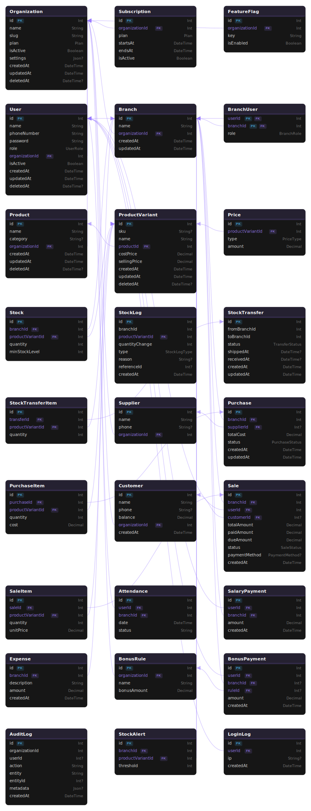

🚀 Enterprise Retail & SaaS Management System
=============================================

📌 Overview
-----------

A high-performance, **multi-tenant SaaS platform** designed for large-scale retail operations. This system enables organizations to manage multiple branches, complex inventory lifecycles, and automated HR/Payroll workflows with granular role-based access control.

✨ Key Features
--------------

*   **Multi-Tenancy:** Complete data isolation for Organizations with subscription-based feature flags.
    
*   **Advanced Inventory:** \* Product variants with multiple pricing tiers (Retail, Wholesale, etc.).
    
    *   Inter-branch stock transfers with status tracking (Pending → Shipped → Received).
        
    *   Automated stock logs and low-stock alerts.
        
*   **Sales & Credit Management:** Support for various payment methods, partial payments, and customer balance tracking.
    
*   **Automated HR & Payroll:** \* Daily attendance tracking.
    
    *   Rule-based bonus calculations and salary disbursement.
        
*   **Financial Reporting:** Integrated expense tracking and purchase order management.
    
*   **Security & Audit:** Comprehensive AuditLog and LoginLog for tracking every system action.
    

🛠 Tech Stack
-------------

*   **Frontend:** Next.js 16+ (App Router) + TypeScript + Tailwind CSS
    
*   **Backend:** Node.js + Express + TypeScript
    
*   **Database:** MySQL (Relational integrity for financial accuracy)
    
*   **ORM:** Prisma (Type-safe database access)
    

🏗 System Architecture
----------------------

The system follows a **Centralized SaaS Architecture** where a single database serves multiple organizations.

*   **ER Diagram:** 
    
*   **Key Logic:** \* **Soft Deletes:** Implemented via deletedAt for Products and Users.
    
    *   **Stock Symmetry:** Managed via FromBranch and ToBranch relations.
        

⚖️ Business Rules
-----------------

*   **Inventory:** Stock is reduced in real-time upon sale completion; StockLog captures the "Why" (Damage, Sale, Transfer).
    
*   **Pricing:** Variants support dynamic price types (e.g., Promotion vs. Distributor).
    
*   **Access Control:** Three-tier hierarchy: Super Admin (SaaS) → Org Admin (Owner) → Branch User (Staff).
    

📈 Project Status
-----------------

**Phase:** 🏗 Development (Core Engine & Schema finalized)